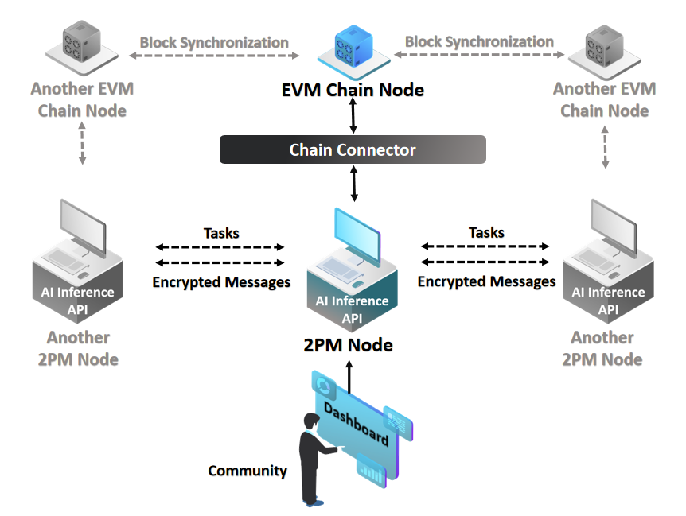

# 2PM-docs
2PM基于[DeltaMPC](https://deltampc.com/)这一基础设施，集成了联邦学习、安全多方计算等多种隐私计算技术。并利用区块链和零知识证明技术，在不获取原始数据的前提下，保证了计算结果的可信性。
## 系统架构

在这里共有三种不同的角色，分别为数据持有者、数据需求者、网络搭建者。
### 数据持有者
数据持有者具有一些隐私数据，希望在不暴露自己的数据的同时与其他参与者一起进行一个计算任务，并共享计算结果，参与者只要搭建一个node，并利用chain-connector接入区块链，就可以从网络中接受计算任务，在本地数据集上执行计算，并将计算结果最终返回网络。
### 数据需求方
数据需求方并不持有数据，但用户存在计算需求，需要与其他数据持有者一起执行机器学习或者统计计算任务，并获取该计算的结果。需求方同样可以通过搭建一个node来接入区块链网络，利用隐私计算技术来获取自己想要的结果。
### 网络搭建者
网络搭建者起到了运维的作用，可以辅助node的搭建，接入工作。
### 一个场景
#### 数据持有者：医院A
医院A拥有大量的病人数据，包括电子病历、影像数据等。医院A希望这些数据不会泄露，但是能够在本地进行计算。
#### 数据需求方：医学研究机构B
医学研究机构B希望在多个医院的数据上进行研究，以训练一个新的疾病诊断模型。他们需要在不同医院的数据上进行模型训练，并保证结果的正确性。
#### 网络搭建者：医疗联盟C
医疗联盟C负责联合多家医院搭建一个隐私计算网络。他们帮助各家医院部署Delta节点，并确保这些节点能够正常运维和接入原始数据源。
#### 具体过程：
- 医疗联盟C帮助医院A部署Delta node，并将医院A的病人数据接入Delta node。
- 研究机构B通过Delta提供的Python框架编写一个疾病诊断模型训练任务。
- 研究机构B将任务通过API提交到隐私计算网络。
- 医院A的Delta node接收任务，在本地病人数据上进行计算，并将加密后的计算结果发送回网络。
- 研究机构B从网络中获取计算结果，进行模型的进一步优化。

## 隐私计算的实现
目前实现的隐私计算任务有两种类型，分别为横向联邦学习和横向联邦统计。其基本流程是一致的，我们可以参考map-reduce的过程，即把计算任务分发到各个数据持有者的终端上进行计算，然后聚合二者的结果。而在横向联邦统计中，map与reduce之间使用了安全聚合的思想，我们只有每个客户端结果的加法和二并没有其真实结果。同时，计算过程中数据归各个客户端所有，而传统mapreduce算法中的数据交换等操作均不能实现。
### 计算流程
任务可以被分成多轮，其中每一次reduce可以看做一轮的结束。在一轮计算执行之前，首先需要等待其他节点的相应，connector会根据每个节点的实际情况，来选取其中几个节点来进行任务的执行。这几个被选定的节点在执行完一轮任务之后，会将数据进行一个安全聚合的过程，最终获取reduce的结果。流程以此类推，直到任务被判定为完成。
### MASCOT协议
除保证所有节点只能得到计算结果，而无法得到任何其他信息之外，我们还需要保证每个人没有提供恶意的数据来保证计算结果的真实性。在这里，我们使用了MASCOT安全多方协议（Faster Malicious Arithmetic Secure Computation with Oblivious Transfer），来保证这一点。
MASCOT协议的实现过程大致分为了如下四部分。
1. 秘密分享：每个参与方将自己的输入值分成若干份，每份都是随机的。这样，即使拿到其中一份，也无法知道原始输入值。
2. 交换分享：参与方通过一种叫做“模糊传输”（Oblivious Transfer，OT）的技术来交换这些份额，确保他们只能获得他们应该得到的份额，而不会泄露其他信息。
3. 局部计算：每个参与方利用自己持有的份额进行一些局部计算。这些计算步骤是设计好的，确保即使是中途计算结果也不会泄露任何关于原始输入的信息。
4. 组合结果：最后，所有参与方将自己的局部计算结果组合在一起，得到最终的计算结果。这个过程依然不会泄露任何参与方的原始输入。
通过这四个步骤，MASCOT协议实现了在多个参与方之间进行安全的计算，确保每个参与方的输入值在整个过程中保持私密。

### 区块链的作用
回到区块链的视角，一个完整的、成功的数据交易任务，需要经历计算节点在任务中使用了之前上链的数据；计算节点最终给出模型收敛；最终模型给到了任务发起者。如果全部验证通过，说明交易可以完成。而上述内容只能完成对于交易正确性的验证，但没有办法保证交易的顺利执行。
如果希望交易的顺利执行，那么很重要的一点就是需要“一手交钱一手交货”。而区块链正可以发挥其作用，来作为这个替代可信第三方。共识算法和代码可以保证任何被制定的规则都可以被强制执行。除此之外，区块链由于其不可篡改性，还是一个天然的审计工具。

## 架构更新
- 在原协议chain-connector设计中，deltampc只兼容了substrate架构的区块链，而在2PM的实现中，不仅保留了原本的区块链连接方式，同时增加了对于诸如scroll等以太坊二层的兼容升级。
- 在原协议中，并没有涉及到任何区块链上的交易，而本次我们实现了一个公共物品应用层，允许用户进行质押、交易。允许用户发送推理数据到2PM网络，2PM提供了交易验证，并返回推理结果的过程。以此实现了一个去中心化的model as a service（de-maas）。

## 合约
合约在scroll上进行了部署及验证，地址如下。

| 合约名称 | 地址 |
| ---- | --------------------|
| IdentityContract | 0xD4ae737D77C4f8A507e3fF04dAf43ab74fad5E80|
| HFLContract | 0xAcCC396A91A82d179a430225A2AFA32b5F355b0D |
| DataHubContract | 0xbd0496CB661C4d0C77638Ce0ac4C7531c9D04C36 |
| HLRContract | 0x1a7d6cA56e298Fb61a7FC05970B114C225bA09Bb |
| PlonkVerifier3Contract | 0x1Ac3508022CD3f44579C85268Bc8590fEBd7280B |

