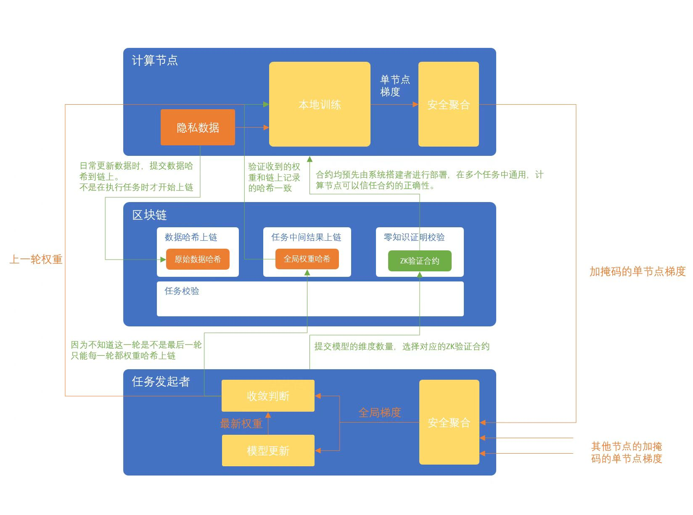

# 2PM-docs 

### Implementation of Privacy Computing and Fully Homomorphic Encryption in Machine Learning

#### Implementation of Privacy Computing

Currently, there are two types of implemented privacy computing tasks: horizontal federated learning and horizontal federated statistics. The basic process is consistent, and we can refer to the map-reduce process. The computation tasks are distributed to the data holders' terminals for processing, and then the results are aggregated. In horizontal federated statistics, the concept of secure aggregation is used between map and reduce, meaning we only get the sum and other aggregate results from each client's data without accessing the actual individual results. During computation, the data remains with each client, and data exchanges typical in traditional map-reduce algorithms are not feasible.

##### Computation Process

Tasks can be divided into multiple rounds, with each reduce operation marking the end of a round. Before executing a round of computation, it is necessary to wait for responses from other nodes. The connector selects several nodes based on their actual conditions to execute the task. After completing a round, these selected nodes perform a secure aggregation process to obtain the reduce results. This process is repeated until the task is deemed complete.

##### MASCOT Protocol

In addition to ensuring that all nodes can only obtain the computation results without accessing any other information, we also need to ensure that no one provides malicious data to guarantee the authenticity of the computation results. For this purpose, we use the MASCOT secure multiparty computation protocol (Faster Malicious Arithmetic Secure Computation with Oblivious Transfer).

The implementation of the MASCOT protocol generally involves the following four parts:

1. **Secret Sharing**: Each participant splits their input value into several parts, each of which is random. Thus, even if one part is obtained, the original input value cannot be determined.

2. **Share Exchange**: Participants use a technique called Oblivious Transfer (OT) to exchange these shares, ensuring they only obtain the shares they should receive without leaking other information.

3. **Local Computation**: Each participant performs some local computations using the shares they hold. These computation steps are designed to ensure that even intermediate results do not leak any information about the original inputs.

4. **Combining Results**: Finally, all participants combine their local computation results to obtain the final computation result. This process still does not leak any participant's original input.

Through these four steps, the MASCOT protocol enables secure computation among multiple participants, ensuring that each participant's input remains private throughout the process.

#### Fully Homomorphic Encryption in Machine Learning

Fully Homomorphic Encryption (FHE) is a powerful technique that allows computations to be performed on encrypted data without decrypting it. This capability is highly valuable in privacy-preserving machine learning, enabling the processing and analysis of sensitive data while maintaining confidentiality.

##### How FHE Works in Machine Learning

1. **Data Encryption**: Initially, the data is encrypted using a homomorphic encryption scheme. The encryption process transforms the data into a ciphered form that can still be used for computations.

2. **Encrypted Computation**: Machine learning models perform computations directly on the encrypted data. Because the data remains encrypted throughout the computation, privacy is preserved. The model's training and inference phases are adapted to work with encrypted inputs and outputs.

3. **Result Decryption**: Once the computations are complete, the resulting encrypted output is sent back to the data owner. The data owner then decrypts the result to obtain the plaintext output.

##### Benefits of FHE in Machine Learning

- **Data Privacy**: FHE ensures that data privacy is maintained, as the data is never exposed in its plaintext form during computations. This is crucial for sensitive data such as medical records, financial information, and personal identifiers.

- **Security**: Since the data remains encrypted, it is protected against potential breaches and unauthorized access during the computation process.

- **Regulatory Compliance**: FHE helps organizations comply with stringent data protection regulations by ensuring that sensitive data is processed securely and privately.

##### Applications of FHE in Machine Learning

- **Healthcare**: Securely analyzing patient data for personalized medicine and diagnostics without compromising patient privacy.
- **Finance**: Conducting risk assessments and fraud detection on encrypted financial data.
- **Marketing**: Personalized marketing and recommendation systems that respect user privacy by processing encrypted consumer data.

By integrating FHE into machine learning workflows, we can unlock the full potential of data-driven insights while ensuring robust privacy and security measures.

